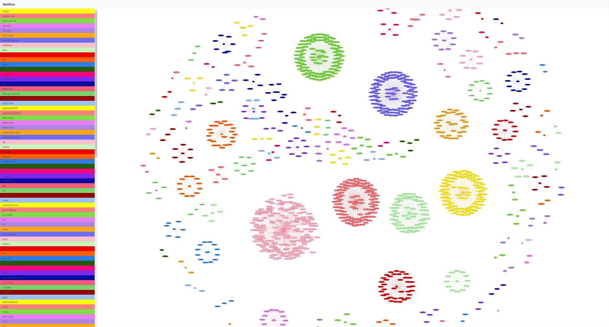

# NetWire

v0.1 - 5th May 2020

NetWire gives you a nice visualisation from the output of your scanner tool. Hover over the buttons on the left for a breakdown of hosts running those services.

This tool will requires a JSON-formatted file (scanneroutput.json) containing an array of IP's, ports, and services, for example:

var data = [
  {
    "IP": "someip",
    "PORT": "someport",
    "SERVICE": "someservice"
  }
]

# Requirements

You can run this on any web server as all of the libraries are downloaded in the browser.
